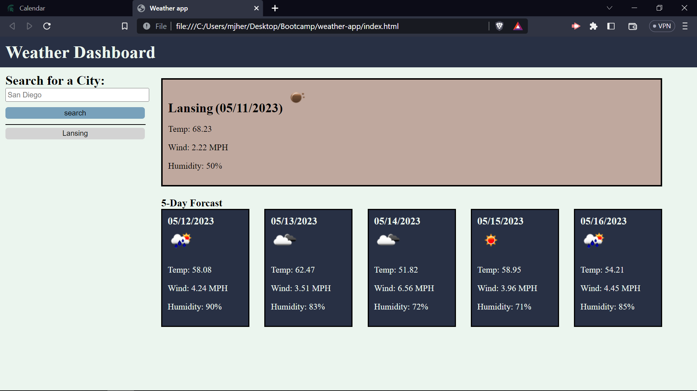
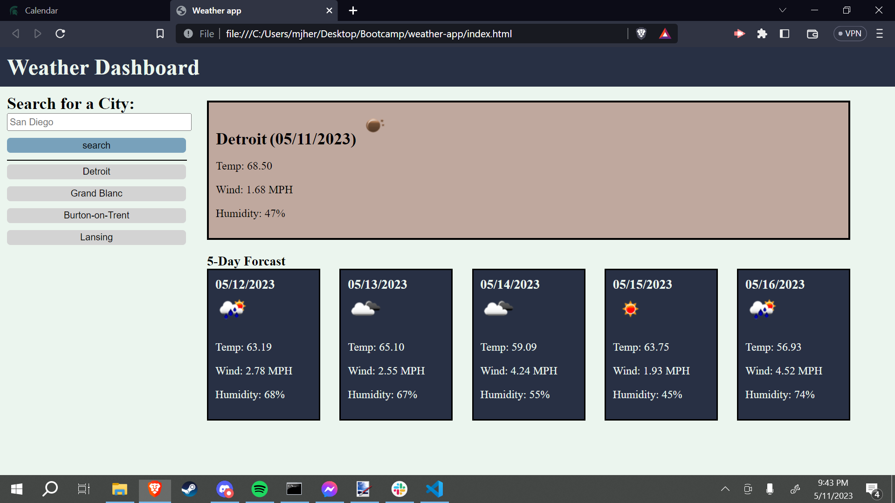

# weather-app
a webpage that displays a 5 day weather forcast for a given city

## objective
Create a webpage that can load the weather for six days starting from today

there should be temperature wind and humidity listed along with an emojii for the type of weather
history should be saved in buttons that will load the citys weather
history should be saved in local storage.

## Screen shots

## Links
github repo
https://github.com/shyguyMatt/weather-app

github pages
https://shyguymatt.github.io/weather-app
